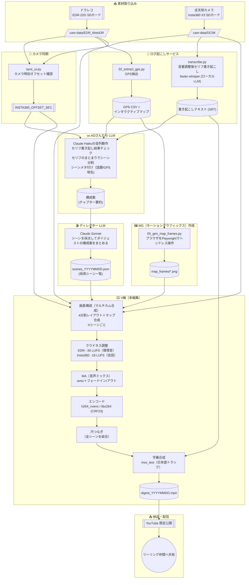

# ツーリングVlog自動生成プロジェクト（仮称）

ツーリングに出かけたバイクの「ドラレコ」と「360度カメラ」のデータを食わせると、AIが自動編集してツーリングダイジェスト動画を作ってくれる、そんなプロジェクトです。

## これがあると何がうれしい？
 [インセプションデッキ](docs/inception-deck.md) を参照

## ざっくり できること

- **会話からの盛り上がり検出** — インカム音声を文字起こしし、LLMが会話の盛り上がりを判定してハイライト区間を自動選定
- **GPS記録による工程の可視化** — ドライブレコーダーのGPSログから走行ルートをインタラクティブマップとして生成
- **複数カメラの自動選択** — 前カメラ・後カメラ・360°カメラの中から、会話の話題に応じて使用カメラをAIが判断、画角を決定（例：「あの交差点」→前カメラ、「みんなで休憩中」→360°）

## 使用機材

| 機材 | 用途 |
|---|---|
| EDR-22G（ドライブレコーダー） | 前方・後方カメラ映像 + GPS記録 + 3軸加速度センサ記録 |
| Insta360 X3 | 360°映像（.insv、デュアル魚眼） |
| B+COM 6XR（インカム） | ライダー間の会話音声（Insta360 X3 に Bluetooth接続 で音声トラックとして記録） |
 

## 進捗状況（現在地）

| 機能 | 状態 |
|---|---|
| GPS抽出＋インタラクティブマップ生成 | ✅ 完成 |
| カメラ間の時刻同期（EDR ⇔ Insta360） | ✅ 完成 |
| 音声文字起こし（faster-whisper） | ✅ 完成 |
| ハイライト自動選定（LLM 2段階パイプライン） | ✅ 完成 |
| ダイジェスト動画の自動合成 | ✅ 完成（4分割レイアウト） |
| GPSマップのフレームシーケンス生成 | ✅ 完成 |
| マップの動画スーパーインポーズ | 🚧 実装中 |
| 冒頭サマリCG（コース全体・日付・走行距離） | 🚧 設計済み・未実装 |
| 360°映像の自動リフレーム・仲間トラッキング | ⬜ 未着手 |

## 処理パイプライン

このプロジェクトの本体は、SDカードの生データからYouTube限定公開に至るまでの一連の自動処理パイプラインです。
各ステップは独立したツールとして実装されていますが、パイプラインの実行は1つのフロントエンドから一度指示するだけ。

## 主要ソフトウェア

- **Python 3.13** / **uv**（依存関係管理）
- **Claude API**（Haiku / Sonnet）— ハイライト判定
- **faster-whisper**（large-v3）— ローカル音声文字起こし
- **FFmpeg** — 動画処理・合成
- **Playwright** — マップのヘッドレスフレーム生成
- **Leaflet**（CartoDB Voyagerタイル）— インタラクティブマップ

## サンプル

見せれるレベルになったらYouTubeに上げます。

## 今後の展望

1. **MS1（MVP）** — 音声からの盛り上がり検出、ハイライト区間抽出、話題に基づくカメラ選択 ✅
2. **MS2（画角）** — 話題からのオブジェクト検出、360°画角の自動決定、仲間のトラッキング
3. **MS3（MAP演出）** — 走行ルート全体＋現在地を表示するマップ映像の生成
4. **MS4以降（フル版）** — 冒頭サマリCG、360°自動リフレームなど
